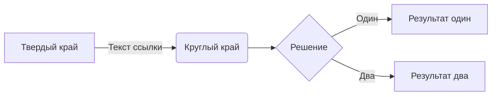
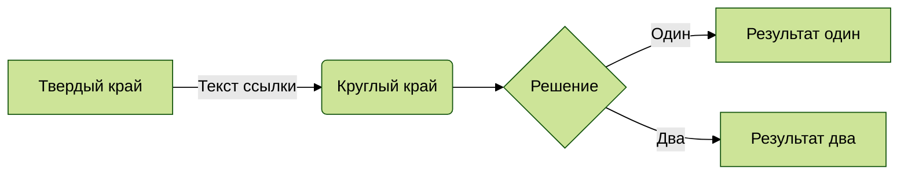
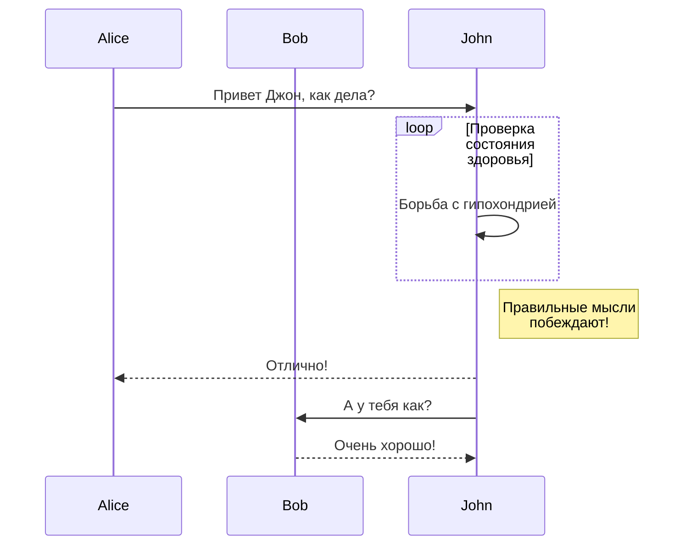
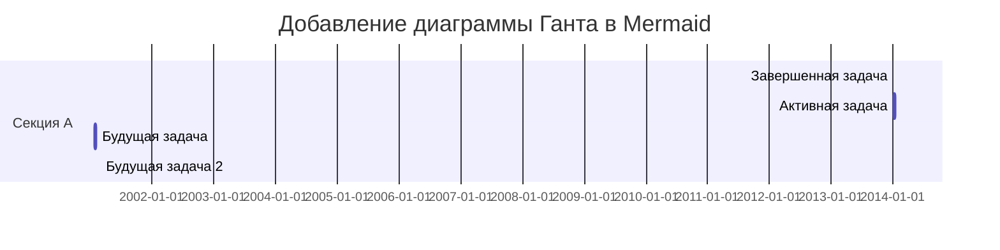
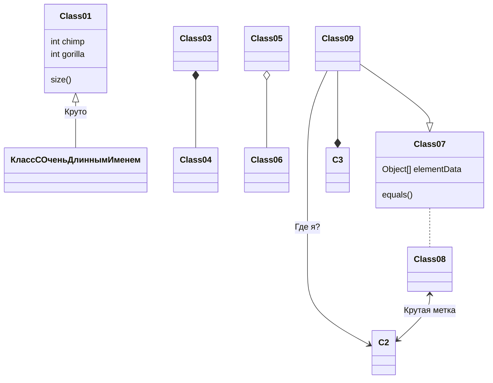
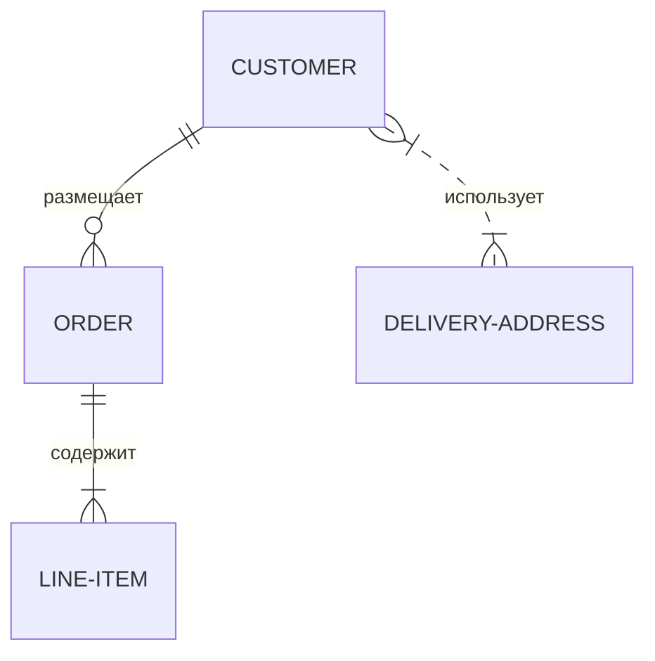
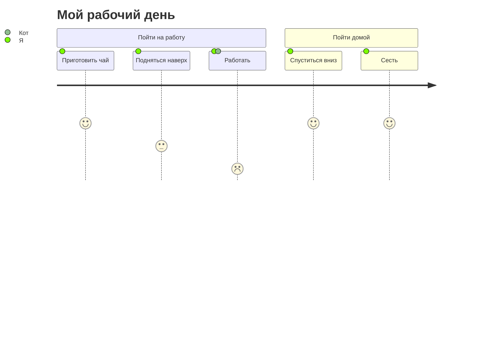

# Mermaid

[Mermaid](https://mermaid-js.github.io/mermaid) - это инструмент для создания диаграмм и графиков, которые можно определить внутри блоков кода в Markdown.


## Синтаксис компонентов

Для создания диаграммы Mermaid схожего с синтаксисом блоков кода, необходимо использовать символ `` ``` `` вокруг кода и указать языковую спецификацию `mermaid`.

~~~ Пример диаграммы Mermaid

~~~


---

## Директивы

Mermaid [директивы](https://mermaid-js.github.io/mermaid/#/directives) могут быть настроены с использованием рекомендованного синтаксиса `%%{init: { }}%%` в качестве первой строки внутри блока `` ```mermaid ``.

Из документации Mermaid:

> Директивы дают автору диаграммы возможность изменять внешний вид диаграммы перед отображением, изменяя примененную конфигурацию.

Все директивы Mermaid поддерживаются Retype.

Следующий пример демонстрирует применение `theme` к диаграмме:

~~~

~~~


### Блок подсветки синтаксиса

Для создания блока кода Mermaid с подсветкой синтаксиса вместо отображения содержимого, используйте языковую спецификацию `mermaid-js` для блока кода.

~~~

~~~


---

## Типы диаграмм

### Блок-схема

Более подробно в документации Mermaid [здесь](https://mermaid-js.github.io/mermaid/#/flowchart).

~~~

~~~


### Диаграмма последовательности

Более подробно в документации Mermaid [здесь](https://mermaid-js.github.io/mermaid/#/sequenceDiagram).


~~~

~~~


### Диаграмма Ганта

Более подробно в документации Mermaid [здесь](https://mermaid-js.github.io/mermaid/#/gantt).

~~~

~~~


### Диаграмма классов

Более подробно в документации Mermaid [здесь](https://mermaid-js.github.io/mermaid/#/classDiagram).

~~~

~~~


### Диаграмма сущность-связь

Более подробно в документации Mermaid [здесь](https://mermaid-js.github.io/mermaid/#/entityRelationshipDiagram).

~~~

~~~


### Путешествие пользователя

Более подробно в документации Mermaid [здесь](https://mermaid-js.github.io/mermaid/#/user-journey).

~~~

~~~


[!ссылка :mermaid: Сайт Mermaid](https://mermaid-js.github.io/mermaid/)